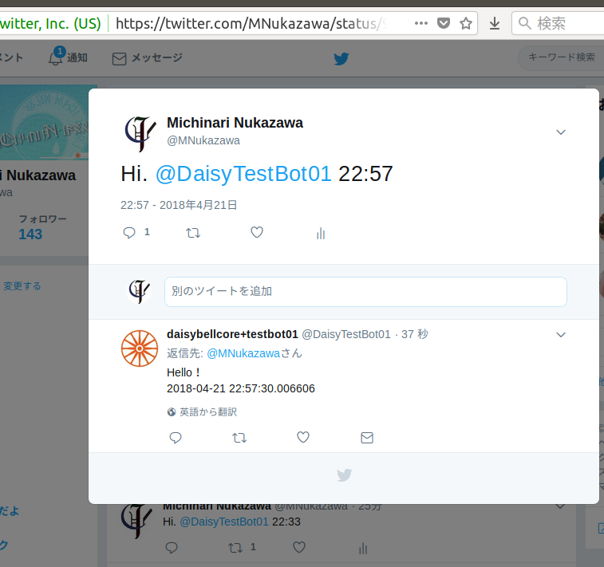

twitter bot daemon mock
====
twitter bot daemonのモック。  


# About
- mentionが来るとretweetまたはquote tweetと、replyを行う。  
- replyとretweetに対してfavoを行う。  
- Bot起動時、自動で日時付きメッセージをツイートする。  

(mention:自アカウントに対する`@ユーザ名`が含まれるツイート)  
(quote tweet:`引用ツイート`)  

  


# Usage
## Create twitter account
twitterアカウントを作成。  
(ヒント: アカウント作施肥に必要なメールアドレスは、ひとつのgoogle accountから、ユーザー名の後ろに「+文字列」を付ける方法で、gmailアドレスを無限に作ることができる)  
https://apps.twitter.com/ にて諸々設定し、諸々のキーを取得。  


## Account
キーなど、アカウントへアクセスするための固有の情報を書いた`client.json`を、実行時のカレントディレクトリに配置する。  
``` : client.json (example)
{
	"consumer_key":		"********",
	"consumer_secret":	"********",
	"access_token":		"********",
	"access_secret":	"********",
	"screen_name":		"DaisyTestBot01"
}
```


## Install
python3およびtweepyをインストールする。  
`sudo apt install python3-pip`  
`pip3 install tweepy`  


## Run
`python3 reply_bot.py`  


# TODO
- `@{screen_name}`が先頭に来るtweetを、mentionではなくreplyと解釈してしまう問題を解決
- コメント付きretweetを実装
- Ctrl+Cでkillした際にtraceback出力ではなく綺麗に正常終了するべき? (瑣末な問題)


# 参考
http://docs.tweepy.org/en/v3.5.0/api.html  
tweepyのAPIリファレンス  

https://developer.twitter.com/en/docs/tweets/data-dictionary/overview/entities-object  
http://biokids.org/?%A4%C9%A4%D6%A4%AA%2FTwitter%A4%C7%CD%B7%A4%DC%A4%A6%A1%AA%2F%A5%C7%A1%BC%A5%BF%B9%BD%C2%A4  
http://westplain.sakuraweb.com/translate/twitter/API-Overview/Entities-in-Objects.cgi#user_mentions  
twitter APIリファレンス公式および、非公式な日本語解説等  

https://qiita.com/ammYou/items/2bcdb54116143cd748f0  
tweepyでmention(`@{screen_name}`)をfavoするBot  

http://net.univ-q.com/archives/38  
twippyでReplyを返すBot  

